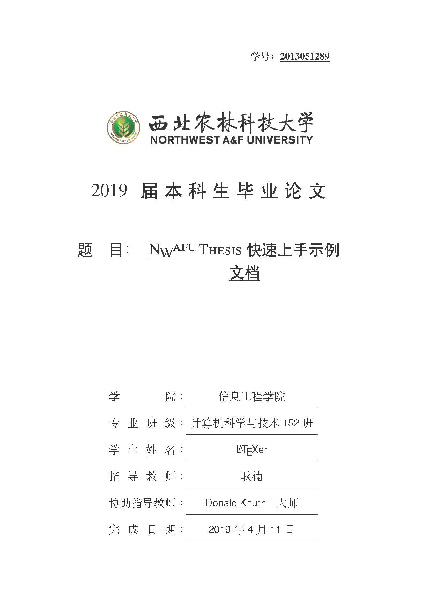
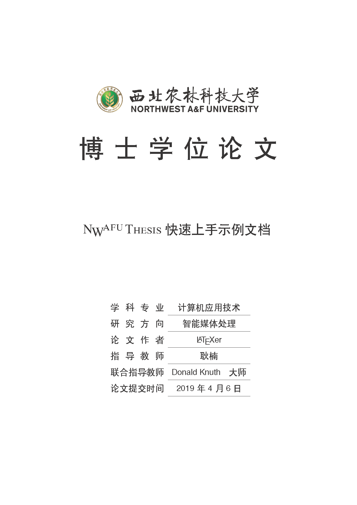

# nwafuthesis

###介绍
---------------------

西北农林科技大学学位论文LaTeX文档类(模板)，支持本科、硕士(学硕、专硕)、博士学位论文。

该模板基于南京航空航天大学毕业论文LaTeX模板，通过修改相关内容实现，参见 "http://www.latexstudio.net/archives/51558.html" ，另外，该模板开发过程中的参考文献样式得到了"biblatex-gb7714-2015样式包"作者胡振震的悉心指导。在此，对他们表示衷心的感谢。

根目录下所有文件为模板开发文档，`demo`下为示例文档，`realease`下的`nwafuthesis-LaTeX.zip`为最终发布文档。

使用该模板时，文件组织建议按如下方式存储：
```
jobname(根目录)
│ 
├── bib(存储参考文献数据库，可以有多个，根据需要增减)
│   └── sample.bib                
├── content(各章节内容，可以有多个章节，根据需要增减)
│   ├── chap00-abs.tex
│   ├── chap01.tex
│   ├── chap02.tex
│   ├── chap03.tex
│   ├── chap04.tex
│   ├── chap05.tex
│   ├── chap06-app1.tex
│   ├── chap07-app2.tex
│   └── chap08-ack.tex
├── figs(插图目录，根据需要增减)
│   ├── data
│   │   ├── plot_2d.csv
│   │   └── plot_3d.csv
│   ├── plot_2d.tex
│   ├── plot_3d.tex
│   ├── tikz_func.tex
│   ├── tikz_rot.tex
│   └── tikz_sum.tex
├── gb7714-2015ay.bbx(参考文献著录、列表样式文件，必须存在，且置于根目录)
├── gb7714-2015ay.cbx(参考文献引注样式文件，必须存在，且置于根目录)
├── logo(学校图标，必须存在，且置于根目录)
│   ├── cie.png
│   ├── nwafu-bar.png
│   ├── nwafubilogo.png
│   ├── nwafu-circle.png
│   ├── NWAFU_logo.png
│   └── nwsuaf_logo_new.png
├── main.tex(主控文件，必须存在，且置于根目录)
├── Makefile(make命令需要的文件，如能执行make，可以在根目录执行make命令进行编译)
├── nwafuthesis.cls(文档类文件，即模板文件，必须存在，且置于根目录)
├── setup(自定义命令、环境等文件、引入宏包文件，可根据需要进行调整)
│   ├── format.tex
│   └── packages.tex
└── texboxie.sty(编译样例需要的宏包，如不需要，可以删除，请注意不能再使用相应命令)
```

###使用说明
---------------------

1. 目前支持本科生毕业论文（设计），硕士(学硕、专硕)、博士学位论文。
2. 请按注释说明使用不同参数及参数组合引入`nwafuthesis`文档类，以选择模板不同工作方式：
   ```
   \documentclass[
     lang=cn,                                         % 目前只支持中文
     % degree=doctor,                      % 博士论文
     % degree=master,                     % 硕士论文(学硕不能使用techmaster参数)
     % techmaster,                             % 专业学位硕士论文(必须与degree=master参数共同作用)
     degree=bachelor,                       % 本科论文(设计)
     type=paper,                                  % 支持paper(论文)或design(设计)(该参数仅对本科生作用)
     % openany,oneside                  % 单面打印
     openright,blankleft,twoside % 双面打印
     ]{nwafuthesis}
   ```   

   使用`\nwafuset`和`\nwafusetEn`命令设置论文基本信息
   ```
   % 设置文档基本信息，\linebreak 前面不要有空格，否则在无需换行的场合，中文之间的空格无法消除
   \nwafuset{
     clscode = {TP391.9},                                             % 分类码，仅研究生需要
     udccode = {004.9},                                                % UDC码，仅研究生需要
     cfdlevel = {公开},                                                    % 密级，仅研究生需要(只能取公开、限制、秘密、机密、绝密五个等级)
     unvcode = {10712},                                               % 学校代码，仅研究生需要，西北农林科技大学取10712
     studentid = {2013051289},                                % 学号，本科/研究生需要
     gradyear = {2019},                                                % 毕业年，本科/研究生需要
     title = {\nwafuthesis{} 快速上手示例文档}, % 论文题目，本科/研究生需要
     professionaltype = {工程硕士},                       % 类型，仅专硕需要(指金融硕士、社会工作硕士、工程硕士、农业推广硕士、兽医硕士、
                                                                                          % 风景园林硕士、林业硕士、中药学硕士、工商管理硕士、公共管理硕士等10种类型。)
     professionalfield = {软件工程},                       % 专硕，仅专硕需要
                                                                                         % 农业推广硕士研究生填写:作物、园艺、农业资源利用、植物保护、养殖、草业、林业、
                                                                                         % 渔业、农业机械化、农村与区域发展、农业科技组织与服务、农业信息化、食品加工与安全;
                                                                                         % 
                                                                                         % 工程硕士研究生填写:建筑与土木工程、水利工程、农业工程、环境工程、食品工程、生物工程等。
     majorsubject = {计算机应用技术},                 % 学科专业，仅研究生需要
     researchfield = {智能媒体处理},                     % 研究方向，仅研究生需要
     researchername = {\LaTeX{}er},                    % 研究生论文作者姓名，仅研究生需要
     major = {计算机科学与技术},                           % 专业，仅本科生需要
     advisers = {耿楠},                                                 % 指导教师姓名，本科/研究生需要
     coadvisers = {Donald Knuth\quad 大师},  % 协助指导教师姓名，本科/研究生需要
     classid = {152},                                                     % 班级号，仅本科生需要(只填写数字，不要有其它内容)
     author = {\LaTeX{}er},                                       % 论文作者姓名，仅本科生需要
     college = {信息工程学院},                                 % 学院名称，仅本科生需要 
     applydate = {\today},                                        % 完成日期(默认为当前日期)，本科/研究生需要
   }
   
   % 英文
   \nwafusetEn{
     cfdlevel = {Open},                                                                                       % 密级，仅研究生需要
     title = {\nwafuthesis{} Quick Start and Document Snippets}, % 论文英文题目，本科/研究生需要
     majorsubject = {Computer Science},                                                 % 学科专业，仅研究生需要
     researchfield = {Multimedia},                                                                % 研究方向，仅研究生需要
     researchername = {\LaTeX{}er},                                                            % 研究生论文作者姓名，仅研究生需要
     advisers = {Geng Nan},                                                                             % 指导教师姓名，本科/研究生需要
     coadvisers = {Donald Knuth, tex.se},                                                 % 协助指导教师姓名，本科/研究生需要
   }
   ```

3. 为确保参考文献样式正确，请务必使用胡振震开发的"biblatex-gb7714-2015样式包"最新版的`gb7714-2015ay.bbx`和`gb7714-2015ay.cbx`样式文件，有关`gb7714-2015ay`样式文件的详情，请参考 "https://github.com/hushidong/biblatex-gb7714-2015" 。

4. 文档编译方式

```
	xelatex jobname.tex
	biber jobname
	xelatex jobname.tex
	xelatex jobname.tex
```

或者

```
	latexmk -xelatex jobname.tex
```

编译引擎使用lualatex也是可以的，只要该引擎编译时ctex宏包能够正确支持中文。

###安装教程
---------------------

1. 需要安装TexLive2018的跨平台LaTeX发行版。
2. 可以使用除Windows记事本外的任何文本编辑器编辑LaTeX代码。

###排版样例
---------------------

1. 本科生论文排版样例




2. 更多样例请查看"./demo"。

###参与贡献
---------------------
1. 本项目由西北农林科技大学信息工程学院耿楠创建和维护
2. 如果您愿意一同参与工作(不计报酬，免费自由)，请及时与作者联系
